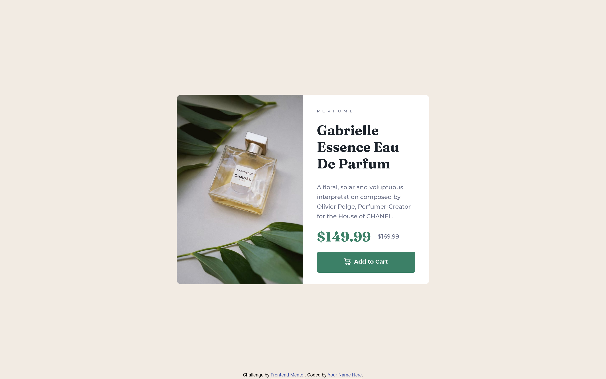

# Frontend Mentor - Product preview card component solution

This is a solution to the [Product preview card component challenge on Frontend Mentor](https://www.frontendmentor.io/challenges/product-preview-card-component-GO7UmttRfa). Frontend Mentor challenges help you improve your coding skills by building realistic projects. 

## Table of contents

- [Frontend Mentor - Product preview card component solution](#frontend-mentor---product-preview-card-component-solution)
  - [Table of contents](#table-of-contents)
  - [Overview](#overview)
    - [The challenge](#the-challenge)
    - [Screenshot](#screenshot)
    - [Links](#links)
  - [My process](#my-process)
    - [Built with](#built-with)
    - [What I learned](#what-i-learned)
    - [Useful resources](#useful-resources)
  - [Author](#author)

## Overview

### The challenge

Users should be able to:

- View the optimal layout depending on their device's screen size
- See hover and focus states for interactive elements

### Screenshot



### Links

- Solution URL: [Solution](https://www.frontendmentor.io/solutions/responsive-mobile-first-product-preview-card-component-DImGnxQpXp)
- Live Site URL: [Live Site](https://product-preview-card-component-alivsaffari.vercel.app/)

## My process

### Built with

- Semantic HTML5 markup
- CSS custom properties
- Flexbox
- Mobile-first workflow

### What I learned

I learn a lot about responsive images on web. I use basic solution for providing multiple images in html. 

```html
<picture>
  <source media="(min-width: 1440px)" srcset="images/image-product-desktop.jpg">
  
</picture>
```

### Useful resources

- [Responsive Image 101](https://cloudfour.com/thinks/responsive-images-101-definitions/) - This helped me for undrestand how responsive images work on web. I really liked this pattern and will use it going forward.

## Author

- Website - [Ali Saffari](https://github.com/alivsaffari/)
- Frontend Mentor - [@alivsaffari](https://www.frontendmentor.io/profile/alivsaffari)
- Twitter - [@alivsaffari](https://www.twitter.com/alivsaffari)
